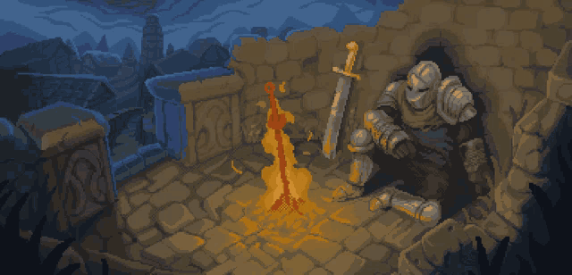

<!--

    Forked from: https://github.com/joao-m-csilva/joao-m-csilva

    Obrigado por acessar meu GitHub. Se você gostou deste repositório, sinta-se livre para fazer um fork e usar de inspiração para montar o seu.
    Peço apenas para deixar uma estrelinha no meu repositório, pois isso me ajuda bastante :)

    =======================================

   Thank you for accessing my GitHub. If you liked this repository, feel free to fork it and use it as inspiration to build your own.
    I only ask you to leave a star on my repository, because it helps me a lot :)

-->

<!-- Banner -->

  
    

<!-- Nome e Título -->

<h3> João Marcos Silva | Desenvolvedor de Software </h3>

<!-- Sobre mim -->

Sou `Desenvolvedor` e estudante de Engenharia de Software pela `UNINTER`. Comecei a programar aos 13 anos, criando sites com HTML, PHP, Bootstrap e WordPress.
Também sou `Técnico em Eletrônica` e `Projetista Elétrico`, e ao longo da carreira tive a oportunidade de desenvolver e liderar equipes em projetos elétricos, de automação e de instrumentação, atuando em parceria com times nacionais e internacionais para grandes companhias como Ambev, Heineken, Fiat e Iveco, entre outras. Essas experiências contribuíram bastante para o desenvolvimento do meu pensamento crítico e da minha capacidade de tomada de decisões.
Hoje, aplico todo esse aprendizado na criação de aplicações voltadas à solução de problemas diversos, sempre seguindo as melhores práticas de mercado, com agilidade e eficiência.

### Vamos conversar?

<!--

Caso queira colocar o link para conversar com você diretamente no Whatsapp, copie o cole o badge abaixo para ficar da mesma forma que os badges de e-mail e LinkedIn.
Substitua o texto 55XXXXXXXXX pelo seu número de telefone, com o código de país e DDD da sua cidade, ex: 5531912345678

-->

 

---

<!-- Badges Personalizáveis -->

### Tecnologias com que trabalho

          

### Ferramentas

      

---

<!-- GitHub Stats -->

|  |  |  |
| :---------------------------------------------------------------------------------------------------------------------------: | :-----------------------------------------------------------------------------------------------------------------------: | :-------------------------------------------------------------------------------------------------------------------------: |

|  |  |
| :--------------------------------------------------------------------------------------------------------------------: | :---------------------------------------------------------------------------------------------------------------------------------------: |

---

<!-- Cursiosidades -->

 

#### Curiosidades sobre mim

Meu animal preferido é o gato, e gosto de tudo que os envolva `(principalmente memes)`. Sou muito fã dos jogos da Fromsoftware, sendo Elden Ring o meu jogo preferido. Gosto bastante da triologia Dark Souls ("joguei todos, zerei todos"). Entre um tempo livre e outro, estou sempre brincando com novas builds em algum souls like.

 

---

